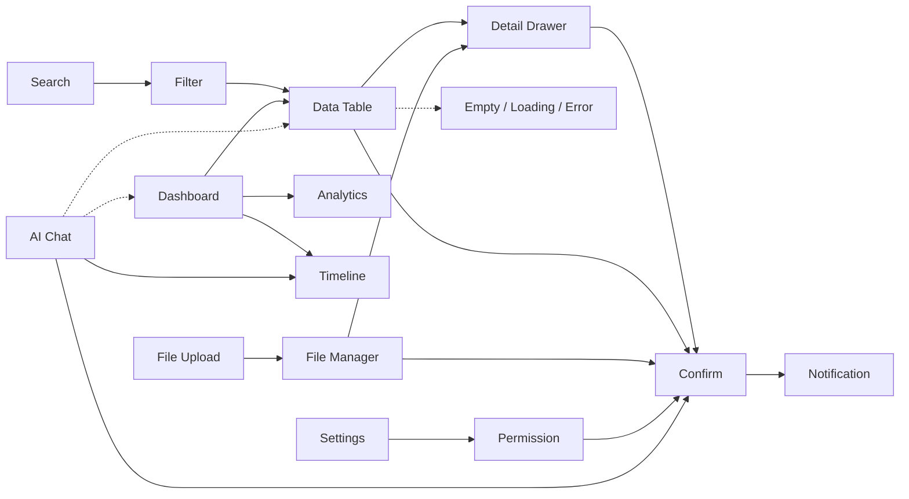

# Pattern Relationships

> **Pattern 연결 그래프** — Screen은 Pattern의 발명이 아니라 **ordered chain**.  
> Recipe 본문: [`recipes/`](./recipes/README.md) · 요약: [`docs/06_SCREEN_RECIPES.md`](../../docs/06_SCREEN_RECIPES.md)

Compose ≠ Generate. 새 Color / Radius / Typography / Modal-in-Modal 금지.

---

## Legend

| Role | Meaning |
| --- | --- |
| **Upstream** | 이 Pattern 앞에 두는 Task |
| **Downstream** | 이 Pattern 다음에 이어지는 Task |
| **Satellite** | 본문 Pattern에 붙는 상태/피드백 (Empty · Loading · Error · Notification) |
| **Overlay** | Drawer · Modal · Confirm — Decision Tree [`07`](../../docs/07_UX_DECISION_TREE.md) |

---

## Core Admin stack (canonical)

```
Search → Filter → Data Table → Detail Drawer → Confirm Dialog
         │            │              │
         │            ├─ Loading (Skeleton)
         │            ├─ Empty State (+ CTA)
         │            └─ Error (+ Retry)
         │
         └─ (optional) Bulk → Confirm Dialog
```

**Why this order:** Search First → Filter Before Data → Data → Pagination · 수정+목록 유지 = Drawer · 삭제 = Confirm · 성공 = Notification (Confirm 밖).

| Edge | Upstream → Downstream | Rule |
| --- | --- | --- |
| Search → Filter | 검색축 확정 후 조건 축소 | Filter never above Search |
| Filter → Data Table | 조건 적용 결과 | Admin stack |
| Data Table → Detail Drawer | 행 상세·수정 | 목록 유지 |
| Detail Drawer → Confirm | 삭제·이탈 | Confirm 1층만 |
| Data Table → Confirm | Bulk 삭제 | 건수 명시 |
| CRUD Form (Page) | 생성 (목록 미유지) | Drawer에 긴 생성 금지 |
| Any mutate → Notification | 성공/실패/Undo | 비차단 |

---

## Graph by Pattern

### Search

| Direction | Patterns |
| --- | --- |
| Downstream | Filter · Data Table · Empty State · Loading |
| Satellite | Empty (0건 CTA) · Loading (결과 Skeleton) · Error |
| Does not replace | Dashboard KPI · AI Chat as list search |

### Filter

| Direction | Patterns |
| --- | --- |
| Upstream | Search |
| Downstream | Data Table · Analytics (기간/세그먼트) · Empty · Loading |
| Not | Settings 저장 폼 (환경 ≠ 목록 Filter) |

### Data Table

| Direction | Patterns |
| --- | --- |
| Upstream | Search · Filter |
| Downstream | Detail Drawer · Confirm (Bulk) · CRUD Form (생성 Page) |
| Satellites | Empty · Loading · Error · Notification (mutate 후) |
| Drill from | Dashboard · Analytics · Permission (행/액션 가시성) |

### Detail Drawer

| Direction | Patterns |
| --- | --- |
| Upstream | Data Table · File Manager (파일 메타) · Kanban (카드 상세) |
| Downstream | Confirm · Notification · Timeline (이력 섹션) |
| Embeds | CRUD Form (짧은 수정) · File Upload (첨부) |
| Not | 긴 생성 Wizard · Modal-in-Modal |

### CRUD Form

| Direction | Patterns |
| --- | --- |
| Surfaces | Detail Drawer (수정+목록) · Page (생성/긴 폼) · Modal (빠른 작업만) |
| Downstream | Confirm (삭제·이탈) · Notification · Error |
| Upstream from | Empty CTA · Dashboard Quick Action |

### Confirm Dialog

| Direction | Patterns |
| --- | --- |
| Upstream | Detail Drawer · Data Table (Bulk) · File Manager · AI Chat (clear/Apply 덮어쓰기) · Kanban (열 삭제 등) |
| Downstream | Notification (완료) · Error (실패) |
| Never | Confirm 안 Table/Form 전체 · Modal in Modal |

### Dashboard

| Direction | Patterns |
| --- | --- |
| Internal chain | KPI → Charts → Activity (Timeline) → Quick Action (≤1 Primary) |
| Downstream | Analytics (심층) · Data Table (drill-down) · CRUD Form (Quick Action) |
| Satellites | Empty · Loading · Notification (이상 알림과 역할 분리) |
| Aid | AI Chat (Compose 보조 — 현황 대체 금지) |

### Analytics

| Direction | Patterns |
| --- | --- |
| Upstream | Dashboard (optional dive) · Filter (기간·세그먼트) |
| Downstream | Data Table (상세 행) · Empty · Loading · Error |
| Export | Notification (완료) — Confirm만으로 Export 성공 붙잡지 않음 |

### File Upload → File Manager

```
File Upload ──(완료)──► File Manager
     │                      │
     └─ Error / Loading     ├─ Detail Drawer (메타)
                            ├─ Confirm (삭제)
                            └─ Empty / Loading
```

Upload는 **전송 Task**; Manager는 **탐색·운영 Task**. 한 화면에 둘 다 있으면 Upload는 Manager 툴바/드롭존으로 compose.

### Settings ↔ Permission

```
Settings (환경 구성)
    └── section / deep-link ──► Permission (역할·ACL)
Permission
    └── 저장/위험 변경 ──► Confirm → Notification
```

Permission은 Settings의 **하위 Task**로 두는 경우가 많음. 독립 Admin 화면도 가능 (팀/역할 전용 Recipe).

### Notification (satellite / global)

| Attaches after | Patterns |
| --- | --- |
| Mutate success/fail | CRUD · Detail Drawer · Confirm · File Upload · Permission · Settings |
| Soft feedback | Undo · 부분 실패 |
| Not | 삭제 확인 대체 (Confirm 필수) · Search 결과 본문 |

### Empty · Loading · Error (satellites on Data / forms)

```
          ┌── Empty State (+ CTA)
Data Table ├── Loading (Skeleton)
          └── Error (+ Retry)

CRUD / Drawer / Dashboard widgets — same triad, scoped to surface
```

### Calendar · Timeline · Kanban (collab)

| Pattern | Upstream | Downstream |
| --- | --- | --- |
| Calendar | Filter (범위) | Detail Drawer / CRUD Modal · Confirm |
| Timeline | Dashboard Activity · Detail 이력 · AI history | Detail Drawer (이벤트) |
| Kanban | Filter (보드/담당) | Detail Drawer · Confirm · Notification |

서로 대체하지 않음: **날짜축 = Calendar** · **이력 = Timeline** · **상태 열 = Kanban**.

### AI Chat (JKO compose aid)

```
AI Chat ──preview──► Confirm (Apply 덮어쓰기) ──► Notification
   │
   ├─ Timeline (prompt / version history)     [optional]
   ├─ Confirm (clear conversation)
   └─ targets: Data Table · Dashboard · CRUD Form · Settings (Compose only)
```

**Never:** Generate로 Kit 우회 · Admin Search를 채팅으로 대체 · 새 토큰 발명.

---

## Mermaid (overview)



---

## Recipe map (domain → chain entry)

| Domain | Typical entry Pattern | Index |
| --- | --- | --- |
| Admin list ops | Search | [`recipes/`](./recipes/README.md#admin) |
| Admin status | Dashboard | same |
| SaaS collab | Calendar / Kanban / Timeline | [`#saas`](./recipes/README.md#saas) |
| AI product | AI Chat | [`#ai`](./recipes/README.md#ai) |

---

## Related

- Pattern index: [`README.md`](./README.md)
- Screen Recipes (expanded): [`recipes/README.md`](./recipes/README.md)
- Docs summary: [`docs/06_SCREEN_RECIPES.md`](../../docs/06_SCREEN_RECIPES.md)
- Decision Tree: [`docs/07_UX_DECISION_TREE.md`](../../docs/07_UX_DECISION_TREE.md)
- Anti-Patterns: [`docs/11_ANTI_PATTERNS.md`](../../docs/11_ANTI_PATTERNS.md)
